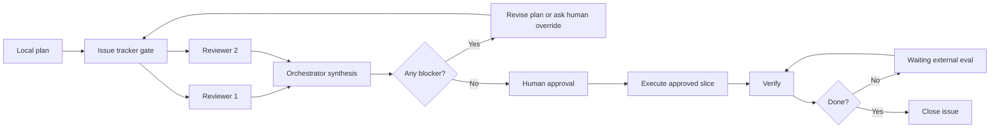

# Four Eyes

Human-approved multi-agent review workflow.

Four Eyes uses the four-eyes principle: high-stakes work should not proceed on one agent's judgment alone.

Four Eyes helps you use AI agents without pretending they are fully autonomous. Agents can plan, review, and execute, but a human approves risky actions.

Unlike role-heavy agent frameworks, Four Eyes asks AI reviewers to judge the same plan independently.

## Shape

- one orchestrator agent owns the plan and execution
- two reviewer agents give independent feedback
- one human approves risky actions
- one issue or parent/child issue set tracks gates, decisions, and verification



## Use It For

- new app, service, or system builds
- production changes
- infrastructure or cloud changes
- security fixes
- schema, data, or platform migrations
- bulk data cleanup

Skip it for one-line fixes, tiny docs, and simple queue/admin work.

## Start

- [Playbook](docs/playbook.md)
- [Templates](docs/templates.md)
- [Linear setup](docs/linear-setup.md)
- [Issue tracker setup](docs/issue-tracker-setup.md)
- [Examples](examples/)

## Linear Quick Setup

[Linear](https://linear.app/) works well as the issue tracker for Four Eyes.

Prerequisite: you already have a Linear workspace and your agent has Linear access.

Copy this into Codex, Claude Code, or another agent:

```text
Set up Four Eyes in Linear.

Source repo: https://github.com/nickzren/four-eyes

If the repo is not available locally, clone or read the source repo first. Then use:
- README.md
- docs/playbook.md
- docs/templates.md
- docs/issue-tracker-setup.md
- docs/linear-setup.md

Create or update Linear docs for the playbook, templates, and issue tracker setup. Create a standing workflow-doc review issue. Keep it brief, public-safe, and generic. Do not add company names, secrets, internal links, or real task history. If repo or Linear access is missing, stop and say exactly what access is needed.
```

## Run Your First Review

Prerequisite: Linear Quick Setup is already complete.

```text
Use the Four Eyes workflow in Linear for this task.

Read the existing Four Eyes Playbook, Templates, and Issue Tracker Setup in Linear first.

Repo path: <repo path>
Plan path: <local plan path>
Linear team/workspace or routing source: <team, workspace, or mapping doc>

Act as orchestrator. Create or update the needed Linear issue(s) from the plan, set ready issue(s) to Review, and return filled Reviewer Prompt templates for each ready issue and each reviewer slot. Include the issue link and `Reviewer slot: 1` or `Reviewer slot: 2` in each prompt. End with the current gate plus my exact next action. Do not execute yet.
```

## Example Agent Mix

Current default:

- Orchestrator: Codex
- Reviewer 1: Codex
- Reviewer 2: Claude Code

These roles are not fixed. Use the strongest current agent for orchestration, and prefer at least one reviewer from a different model family than the orchestrator.

## Source Of Truth

Use this repo as the version-controlled source.

If you maintain a Linear copy, update this repo and Linear in the same task. Do not let tracker docs become the only durable copy.

## License

MIT
