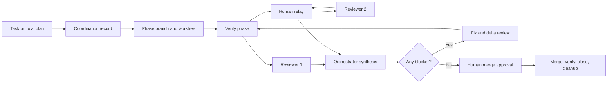

# Four Eyes

Human-approved multi-agent review workflow.

Four Eyes uses independent agent judgment before high-stakes work proceeds. One orchestrator owns execution, reviewers judge independently, and the human approves real risk gates.

The policy is tool-agnostic, manual-first, and rule-only. It does not require a workflow runtime, tracker vendor, plugin, skill, or marketplace product.

## Shape

- one orchestrator owns the plan, implementation, synthesis, and coordination record
- one or two reviewers provide independent judgment according to the selected tier
- one human approves merge and other risky actions
- one pull request, GitHub parent issue, or temporary local record preserves resumable state

Reviewers return verdicts to the orchestrator or human relay. The orchestrator alone updates coordination metadata, gates, ledgers, and closeout.

## Default Workflow

1. If the task input is not clear enough to execute, the orchestrator writes a temporary local executable plan.
2. The orchestrator records `Coordination record: pr | github-issue | local`; single-phase remote work defaults to `pr`.
3. If the work is multi-phase, the orchestrator creates one parent ledger with dependencies, status, branch or PR, gate, and next action.
4. Reviewers confirm a defining plan before implementation using the same isolated handoff as later reviews.
5. For each implementation phase, the orchestrator creates a phase branch and dedicated worktree while the primary checkout stays fixed and coordination-only.
6. In that worktree, the orchestrator verifies the baseline, implements the whole phase, commits the phase branch, pushes it only when Push Authorization permits it, and runs verification.
7. The orchestrator opens or updates the pull request and prepares the reviewer handoff.
8. Reviewer 1 may run as a named isolated internal subagent. Reviewer 2 stays human-relayed by default; direct review requires exact human-approved model, call, cost, and isolation bounds.
9. Reviewers inspect the exact revision-bound artifact independently and return one verdict for the numbered round.
10. After all expected slots return or have terminal records, the orchestrator posts carried verdicts verbatim, rechecks identity and repository state, then synthesizes.
11. Blocking findings are fixed on the phase branch and receive the required delta review. Accepted nits are deferred by default unless a human, acceptance criterion, or existing gate requires the change now.
12. When reviewers approve, the human approves merge to `main` or another protected branch.
13. The orchestrator merges, verifies, records closeout, resolves owned worktrees and branches, then removes temporary local artifacts.

This default shows the Full review path. Light uses one opposite-family reviewer. Skip uses no reviewer.

Task input can be a user prompt, GitHub issue, pull request, local note, or existing plan. Temporary local plans remain uncommitted and are removed only after verified closeout.


```mermaid
flowchart LR
    Plan["Task or local plan"] --> Record["Coordination record"]
    Record --> Work["Phase branch and worktree"]
    Work --> Verify["Verify phase"]
    Verify --> R1["Reviewer 1"]
    Verify --> Relay["Human relay"]
    Relay --> R2["Reviewer 2"]
    R1 --> Synth["Orchestrator synthesis"]
    R2 --> Relay
    Relay --> Synth
    Synth --> Decision{"Any blocker?"}
    Decision -->|Yes| Fix["Fix and delta review"]
    Fix --> Verify
    Decision -->|No| Approve["Human merge approval"]
    Approve --> Merge["Merge, verify, close, cleanup"]
```

## Use It For

- new systems and broad feature phases
- production, infrastructure, security, schema, or data changes
- destructive, costly, or hard-to-reverse work

Skip it for one-line fixes, tiny docs, formatting, and simple administration.

## Manual Operating Mode

1. Codex App or another primary agent acts as orchestrator.
2. The orchestrator may create or reuse the isolated named Reviewer 1 subagent `reviewer1` for the parent workflow.
3. Start or reuse manual external Reviewer 2 exactly as defined in [Role Contracts](docs/role-contracts.md#reviewer); the human sends each prompt and relays each verdict.
4. The orchestrator synthesizes, updates the coordination record, fixes blockers, and asks for human approval only at real gates.

Optional direct Reviewer 2 removes the copy/paste step only when the platform supplies isolated fresh context and the human authorizes exact model, call, and cost bounds. Manual relay remains the default and fallback.

## Phase Branch Mode

Use one branch and one dedicated worktree per independently mergeable implementation phase. The primary checkout remains on the recorded base and coordination-only.

The orchestrator may commit to the recorded phase branch without per-commit approval. It may push only when Push Authorization permits it; human approval remains required before merge to a protected branch.

Every workflow-owned worktree and branch must resolve at closeout. Default to `Post-merge branch cleanup: yes` and `Abandoned branch cleanup: ask`.

## Review Transport

Use `Review transport: pr | manual-relay`.

Default to `pr` for remote phase-branch implementation. Use `manual-relay` for local or no-remote work, or when the plan explicitly records that a pull request adds no useful coordination or audit value.

The pull request carries the immutable review artifact and becomes the coordination record after the local state copy is verified.

Artifact identity, mutation checks, verdict embargo, stale approvals, and nit handling are defined in the [Playbook](docs/playbook.md).

## Coordination Records

Use `Coordination record: pr | github-issue | local`.

- `pr`: default for single-phase remote work
- `github-issue`: one parent ledger for multi-phase work, outside-PR blockers, or follow-ups that must survive PR closeout
- `local`: temporary resumability when no forge record exists

Do not create one child issue per phase. Create child issues only for independently owned, externally blocked, or accepted durable follow-up work.

## Review Tiers

- Skip: tiny, low-risk work; verification plus the configured merge gate.
- Light: default for routine low-risk reversible work; one opposite-family reviewer and at most one bounded same-reviewer fix/delta.
- Full: two independent reviewers for broad or high-risk work.

The human or reviewed plan sets the tier. The orchestrator may escalate but never self-downgrade.

Review phases, not every bug. Split only when gates, rollback, owners, repos, deploy windows, or risk classes differ.

## Start

- [Playbook](docs/playbook.md)
- [Role contracts](docs/role-contracts.md)
- [Templates](docs/templates.md)
- [Coordination records](docs/coordination-records.md)
- [Examples](examples/)

## Use In Another Repository

Add this pointer to the target repository's `AGENTS.md`:

```markdown
## Four Eyes

Use Four Eyes for broad, multi-phase, production, infrastructure, security,
schema, data, costly, destructive, or hard-to-reverse work.

Policy: https://github.com/nickzren/four-eyes at <full 40-character commit SHA>
Load first: README "Default Workflow" and docs/role-contracts.md
Load on demand: docs/playbook.md, docs/templates.md, docs/coordination-records.md

Skip for one-line fixes, tiny docs, formatting, and simple administration.
```

For Claude Code, add this target-repository `CLAUDE.md`:

```markdown
@AGENTS.md
```

## Run Your First Review

```text
Use the Four Eyes workflow for this task.

Load the task context, Four Eyes Default Workflow, and Four Eyes Role Contracts first. Load Four Eyes Playbook, Templates, or Coordination Records only when the task needs their exact rule, template, or coordination behavior.

Repo path: <repo path>
Plan path: <local plan path or none>
Coordination record: pr | github-issue | local
Reviewer 2 handoff: manual external reviewer | direct Claude reviewer
Direct Reviewer 2 authorization: none | human-approved phase + full model + maximum calls + maximum cost

Act as orchestrator. Use phase branch and worktree mode for implementation phases. Keep the primary checkout fixed and coordination-only. Default to `pr` for remote phase-branch implementation; use `manual-relay` for local or no-remote work, or when the plan explicitly records that a pull request adds no useful coordination or audit value. Infer practical phases when needed and keep their dependencies and gates in one parent ledger.

Run or reuse internal Reviewer 1 when available. Return the filled Reviewer 2 prompt for human relay unless direct mode is explicitly authorized. Reviewers never edit coordination metadata.

Do not merge to a protected branch. End with the current gate and exact next human action.
```

## Example Agent Mix

- Orchestrator: Codex App
- Reviewer 1: named Codex subagent `reviewer1`
- Reviewer 2: Claude Code, human-relayed by default

For non-skip work, require at least one expected reviewer from a different model family than the author or orchestrator unless the human explicitly overrides the panel.

## Loading

Default orchestrator bootstrap is:

- the task context
- Four Eyes Default Workflow
- Four Eyes Role Contracts

Load Four Eyes Playbook only for exact policy detail or canonical commands, Templates only to fill an artifact, and Coordination Records only for coordination behavior. Reviewers receive a filled immutable packet and exact task evidence; they do not need the workflow-document set unless a disputed rule itself is under review.

## Context Budget

The reproducible pre-change source bootstrap at revision `225430672fad342d693137254c256ca44f2bd8ef` was 92,036 UTF-8 bytes:

- README Default Workflow section: 2,630 bytes
- complete Playbook: 54,802 bytes
- complete Templates: 25,609 bytes
- complete Issue Tracker Setup: 8,995 bytes

The current bootstrap is the README Default Workflow section plus generated Role Contracts. `ruby scripts/check-docs.rb` reports its bytes, savings, and reduction; the current bootstrap must not exceed 12,000 bytes.

## Source Of Truth

Load workflow policy from one recorded full commit SHA in this repository. Missing, abbreviated, mixed, or unresolvable revisions hold the gate.

Agents working in another repository read these documents from a local clone pinned at that SHA or from the same SHA on the forge. Do not copy the policy documents into the target repository.

`scripts/check-docs.rb` validates documentation and regenerates Role Contracts. It never invokes reviewers or executes the workflow.

## License

MIT
