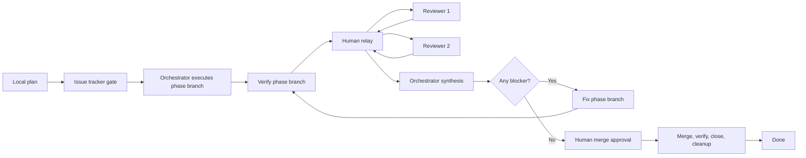

# Four Eyes

Human-approved multi-agent review workflow.

Four Eyes uses the four-eyes principle: high-stakes work should not proceed on one agent's judgment alone.

Four Eyes helps you use AI agents without pretending they are fully autonomous. Agents can plan, review, and execute, but a human approves risky actions.

Unlike role-heavy agent frameworks, Four Eyes asks AI reviewers to judge the same plan independently.

## Shape

- one orchestrator agent owns the plan and execution
- two reviewer agents give independent feedback
- one human approves risky actions
- one issue or parent/child issue set tracks gates, decisions, and verification

The core policy is tool-agnostic and manual-first. Codex can orchestrate while separate reviewer agents judge independently.

Linear or another issue tracker is the audit and status record, not the reviewer message bus. Reviewers return verdicts to the orchestrator or human relay; the orchestrator decides what status, synthesis, gate, and required-action updates belong in the tracker.

## Default Workflow

1. Give the orchestrator a local executable plan.
2. If the plan is big and has no phases, the orchestrator infers practical phases and creates a Linear parent issue plus phase child issues.
3. For each phase, the orchestrator creates a phase branch from the base branch.
4. The orchestrator implements the whole phase, commits to the phase branch, pushes only that branch, runs verification, and moves the phase issue to Review.
5. The orchestrator prepares the review transport: PR when useful, manual relay when simpler.
6. Reviewers review the PR or packet independently and return verdicts outside the tracker.
7. The human pastes the review replies back to the orchestrator.
8. If blocked, the orchestrator fixes the phase branch and requests delta review.
9. When reviewers approve, the human approves merge to `main` or another protected branch.
10. The orchestrator merges, verifies, updates or closes the tracker item, and deletes the phase branch if approved.

This default shows the Full review path. Light uses one opposite-family reviewer. Skip uses no reviewer.


```mermaid
flowchart LR
    Plan["Local plan"] --> Issue["Issue tracker gate"]
    Issue --> Work["Orchestrator executes phase branch"]
    Work --> Verify["Verify phase branch"]
    Verify --> Relay["Human relay"]
    Relay --> R1["Reviewer 1"]
    Relay --> R2["Reviewer 2"]
    R1 --> Relay
    R2 --> Relay
    Relay --> Synth["Orchestrator synthesis"]
    Synth --> Decision{"Any blocker?"}
    Decision -->|Yes| Fix["Fix phase branch"]
    Fix --> Verify
    Decision -->|No| Approve["Human merge approval"]
    Approve --> Merge["Merge, verify, close, cleanup"]
    Merge --> Done["Done"]
```

## Use It For

- new app, service, or system builds
- production changes
- infrastructure or cloud changes
- security fixes
- schema, data, or platform migrations
- bulk data cleanup

Skip it for one-line fixes, tiny docs, and simple queue/admin work.

## Manual Operating Mode

Manual mode is the supported workflow:

1. Codex App or another primary agent acts as orchestrator.
2. The human sends reviewer prompts to the expected reviewer slots for the selected tier.
3. Reviewers reply to the human with independent verdicts.
4. The human pastes the review replies back to the orchestrator.
5. The orchestrator synthesizes, updates Linear when useful, fixes blockers, and asks for human approval at real gates.

Manual mode preserves independent judgment and keeps the workflow simple. It relies on the human to relay messages and keep reviewer outputs separate until the expected reviews are complete.

## Phase Branch Mode

For high-throughput work, use one branch per phase.

Phase branch mode is the default high-throughput path for repo implementation phases when branch pushes are safe. The orchestrator may create the phase branch, implement the whole phase, commit to it, and push updates to that branch without asking the human for every commit or push. Reviewers review the phase branch diff and verification evidence after the phase is implemented, not after every bug.

Human approval is still required before merging into `main` or another protected branch. The merge approval can also authorize post-merge verification, tracker closeout, and deleting the phase branch after the merge.

Phase branch mode is allowed only when branch pushes do not deploy, mutate live systems, publish releases, or trigger other hard-to-reverse external actions. If a branch push has those effects, treat push as a human gate.

## Review Transport

Use `Review transport: pr | manual-relay`.

Default to `pr` when the repo has a remote and CI or branch protection. The PR is the review artifact; Linear stays the gate and status record.

Use `manual-relay` for local, no-remote, or simple work where a PR adds overhead.

## Review Tiers

- Skip: tiny docs, typos, formatting, and simple queue/admin work; run verification and keep the configured branch or merge gate.
- Light: routine low-risk, reversible repo work; one opposite-family reviewer, one round, no auto-fix loop. This is a single-review shortcut, not full Four Eyes.
- Full: high-risk or broad changes; two independent reviewers and bounded fix/re-review. Use Full for security, infrastructure, data/schema, production, deploy, destructive, costly, or irreversible work.

The human or local plan sets the review tier. The orchestrator may escalate the tier, but must not downgrade its own work without explicit human instruction.

Review phases, not every bug. One phase may contain many related small fixes when they share scope, risk, verification, and rollback. Split only when gates, rollback, owners, repos, deploy windows, or risk class differ.

If a big local executable plan has no phases yet, the orchestrator should infer practical phases from scope, files, verification, risk, and rollback, then create the parent issue and phase child issues in the tracker. It should ask the human only when the split changes risk, ownership, merge target, deploy behavior, or there are multiple materially different valid decompositions.

## Start

- [Playbook](docs/playbook.md)
- [Templates](docs/templates.md)
- [Linear setup](docs/linear-setup.md)
- [Issue tracker setup](docs/issue-tracker-setup.md)
- [Examples](examples/)

## Linear Quick Setup

[Linear](https://linear.app/) works well as the issue tracker for Four Eyes.

Prerequisite: you already have a Linear workspace and your agent has Linear access.

Copy this into Codex, Claude Code, or another agent:

```text
Set up Four Eyes in Linear.

Source repo: https://github.com/nickzren/four-eyes

If the repo is not available locally, clone or read the source repo first. Then use:
- README.md
- docs/playbook.md
- docs/templates.md
- docs/issue-tracker-setup.md
- docs/linear-setup.md

Create or update Linear docs for the default workflow, playbook, templates, issue tracker setup, and Linear setup. Make phase branch mode with implementation-first flow the default high-throughput path. Make review transport default to `pr` when the repo has a remote and CI or branch protection, otherwise `manual-relay`. Create a standing workflow-doc review issue. Keep it brief, public-safe, and generic. Do not add company names, secrets, internal links, or real task history. If repo or Linear access is missing, stop and say exactly what access is needed.
```

## Run Your First Review

Prerequisite: Linear Quick Setup is already complete.

```text
Use the Four Eyes workflow in Linear for this task.

Read the existing Four Eyes Default Workflow, Playbook, Templates, and Issue Tracker Setup in Linear first.

Repo path: <repo path>
Plan path: <local plan path>
Linear team/workspace or routing source: <team, workspace, or mapping doc>

Act as orchestrator.

Use phase branch mode with implementation-first flow unless the plan says otherwise.
Use review transport `pr` when the repo has a remote and CI or branch protection; otherwise use `manual-relay`.

If the plan is large and has no phases, infer practical phases from scope, files, verification, risk, branch target, and rollback. Create a Linear parent issue plus phase child issues.

Before pushing a phase branch, confirm branch pushes do not deploy, mutate live systems, publish releases, or trigger hard-to-reverse external effects. If they do, stop and ask for human approval before pushing.

For the first ready phase:
1. Create a phase branch from the base branch.
2. Implement the whole phase.
3. Commit and push only the named phase branch.
4. Run verification.
5. If review transport is `pr`, open or update the PR from phase branch to merge target.
6. Update Linear to Review.
7. Return filled Reviewer Prompt templates for the expected reviewer slots, including the issue link, review transport, PR link or phase branch, diff summary, verification evidence, and reviewer slot number.

Do not merge to main or another protected branch. End with the current gate plus my exact next action.
```

## Example Agent Mix

Current default:

- Orchestrator: Codex App
- Reviewer 1: Codex in a separate session
- Reviewer 2: Claude Code

These roles are not fixed. Use the strongest current agent for orchestration, and prefer at least one reviewer from a different model family than the agent that wrote the change under review.

## Source Of Truth

Use this repo as the version-controlled source.

Keep synced Linear docs updated from this repo.

## License

MIT
