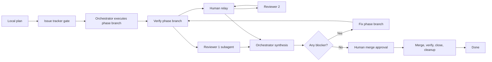

# Four Eyes

Human-approved multi-agent review workflow.

Four Eyes uses the four-eyes principle: high-stakes work should not proceed on one agent's judgment alone.

Four Eyes helps you use AI agents without pretending they are fully autonomous. Agents can plan, review, and execute, but a human approves risky actions.

Unlike role-heavy agent frameworks, Four Eyes asks AI reviewers to judge the same plan independently.

## Shape

- one orchestrator agent owns the plan and execution
- two reviewer agents give independent feedback
- one human approves risky actions
- one issue or parent/child issue set tracks gates, decisions, and verification

The core policy is tool-agnostic and manual-first. Codex can orchestrate while separate reviewer agents judge independently.

Linear or another issue tracker is the audit and status record, not the reviewer message bus. Reviewers return verdicts to the orchestrator or human relay; the orchestrator decides what status, synthesis, gate, and required-action updates belong in the tracker.

## Default Workflow

1. If the task input is not clear enough to execute, the orchestrator writes a temporary local executable plan.
2. If the plan is big and has no phases, the orchestrator infers practical phases and creates a Linear parent issue plus phase child issues.
3. Reviewers confirm the plan before implementation starts when the plan defines the work, using the same reviewer handoff as later reviews.
4. For each phase, the orchestrator creates a phase branch and dedicated worktree from the base while the primary checkout stays coordination-only.
5. In that worktree, the orchestrator verifies the baseline, implements the whole phase, commits and pushes only the phase branch, runs verification, and moves the phase issue to Review.
6. The orchestrator prepares the review transport and reviewer handoff.
7. When available, the orchestrator runs Reviewer 1 as a named isolated internal subagent and reuses it for the phase or parent workflow. Reviewer 2 stays human-relayed by default; optional direct Claude review is allowed only through a native isolated invocation tool under exact human-approved phase, model, call, and cost bounds.
8. Reviewers inspect the exact revision-bound PR or packet independently and return verdicts outside the tracker.
9. After every expected slot returns or has a terminal record, the orchestrator posts carried verdicts verbatim, verifies the repository and artifact are unchanged, then synthesizes.
10. If blocked or an accepted nit changes the artifact, the orchestrator fixes the phase branch and requests the required delta review.
11. When reviewers approve, the human approves merge to `main` or another protected branch.
12. The orchestrator merges, verifies, resolves every owned worktree, applies authorized branch cleanup, updates or closes the tracker item, and removes the temporary local plan.

This default shows the Full review path. Light uses one opposite-family reviewer. Skip uses no reviewer.

Task input can be a user prompt, tracker issue, local note, or existing plan. Temporary local executable plans are coordination artifacts. They should stay uncommitted, be reviewed when they define unclear work, and be removed after closeout.


```mermaid
flowchart LR
    Plan["Local plan"] --> Issue["Issue tracker gate"]
    Issue --> Work["Orchestrator executes phase branch"]
    Work --> Verify["Verify phase branch"]
    Verify --> R1["Reviewer 1 subagent"]
    Verify --> Relay["Human relay"]
    Relay --> R2["Reviewer 2"]
    R1 --> Synth
    R2 --> Relay
    Relay --> Synth["Orchestrator synthesis"]
    Synth --> Decision{"Any blocker?"}
    Decision -->|Yes| Fix["Fix phase branch"]
    Fix --> Verify
    Decision -->|No| Approve["Human merge approval"]
    Approve --> Merge["Merge, verify, close, cleanup"]
    Merge --> Done["Done"]
```

## Use It For

- new app, service, or system builds
- production changes
- infrastructure or cloud changes
- security fixes
- schema, data, or platform migrations
- bulk data cleanup

Skip it for one-line fixes, tiny docs, and simple queue/admin work.

## Manual Operating Mode

Manual mode is the supported default and fallback:

1. Codex App or another primary agent acts as orchestrator.
2. If available, the orchestrator creates or reuses a named isolated Reviewer 1 subagent for the phase or parent workflow.
3. The orchestrator launches only internal Reviewer 1. The human sends every manual external reviewer prompt, including Reviewer 2 by default.
4. External reviewers reply to the human with independent verdicts.
5. The human pastes the external review replies back to the orchestrator.
6. The orchestrator synthesizes, updates Linear when useful, fixes blockers, and asks for human approval at real gates.

Manual mode preserves independent judgment and keeps the workflow simple. It relies on the orchestrator to isolate any internal reviewer subagent and on the human to relay only external reviewer messages.

Optional direct Claude review can remove the Reviewer 2 copy/paste step only when the orchestrator platform already provides an isolated fresh-context invocation tool and the human authorizes the exact task or phase, full model identity, maximum calls, and maximum cost amount and currency. Four Eyes supplies the rules, not the invocation runtime. Manual relay remains the default and fallback.

For a Codex-led workflow, Reviewer 1 may be a reusable named Codex subagent. That gives isolated reviewer context and continuity, not model-family independence. Reviewer 2 should be the opposite-family reviewer when the tier requires independent judgment across model families.

## Phase Branch Mode

For high-throughput work, use one branch per phase.

Phase branch mode is the default high-throughput path for repo implementation phases when branch pushes are safe. The orchestrator may create the phase branch, implement the whole phase, commit to it, and push updates to that branch without asking the human for every commit or push. Reviewers review the phase branch diff and verification evidence after the phase is implemented, not after every bug.

With phase branch mode on, worktree mode defaults to on: create one dedicated worktree for the phase branch and keep the primary checkout fixed on the recorded base. Worktree mode off with phase branch mode on requires explicit human approval; worktree mode on with phase branch mode off is invalid. Remove every workflow-owned worktree through its recorded lifecycle before deleting its branch.

Human approval is still required before merging into `main` or another protected branch. The merge approval can also authorize post-merge verification, tracker closeout, and deleting the phase branch after the merge.

Every agent-created phase branch must be resolved at closeout. Default to `Post-merge branch cleanup: yes` and `Abandoned branch cleanup: ask`. If a phase branch is not merged, the orchestrator records whether it was abandoned, intentionally kept with an owner and revisit trigger, or handed off to the human. Abandoned cleanup may close this workflow's PR under the same cleanup gate.

Phase branch mode is allowed only when branch pushes do not deploy, mutate live systems, publish releases, or trigger other hard-to-reverse external actions. If a branch push has those effects, treat push as a human gate.

## Review Transport

Use `Review transport: pr | manual-relay`.

Default to `pr` when the repo has a remote and CI or branch protection. The PR is the review artifact; Linear stays the gate and status record.

Selecting `pr` pre-authorizes the orchestrator to create or update the PR for the recorded phase branch and merge target, maintain its bounded review description, request the expected reviewers, and submit expected reviewer verdicts. It does not authorize merge, unrelated PR changes, repository-setting changes, or other GitHub writes.

Use `manual-relay` for local, no-remote, or simple work where a PR adds overhead.

Workflow revision, artifact identity, repository mutation checks, verdict embargo, stale approvals, and nit handling are defined in the [Playbook](docs/playbook.md).

## Review Tiers

- Skip: tiny docs, typos, formatting, and simple queue/admin work; run verification and keep the configured branch or merge gate.
- Light: default for routine low-risk, reversible repo work; one opposite-family reviewer, one initial review, and at most one bounded same-reviewer fix/delta when scope and risk stay unchanged. Then escalate. This is not full Four Eyes.
- Full: high-risk or broad changes; two independent reviewers and bounded fix/re-review. Use Full for security, infrastructure, data/schema, production, deploy, destructive, costly, or irreversible work.

The human or local plan sets the review tier. The orchestrator may escalate the tier, but must not downgrade its own work without explicit human instruction.

Review phases, not every bug. One phase may contain many related small fixes when they share scope, risk, verification, and rollback. Split only when gates, rollback, owners, repos, deploy windows, or risk class differ.

If a big local executable plan has no phases yet, the orchestrator should infer practical phases from scope, files, verification, risk, and rollback, then create the parent issue and phase child issues in the tracker. It should ask the human only when the split changes risk, ownership, merge target, deploy behavior, or there are multiple materially different valid decompositions.

## Start

- [Playbook](docs/playbook.md)
- [Role contracts](docs/role-contracts.md)
- [Templates](docs/templates.md)
- [Linear setup](docs/linear-setup.md)
- [Issue tracker setup](docs/issue-tracker-setup.md)
- [Examples](examples/)

## Linear Quick Setup

[Linear](https://linear.app/) works well as the issue tracker for Four Eyes.

Prerequisite: you already have a Linear workspace and your agent has Linear access.

Copy this into Codex, Claude Code, or another agent:

```text
Set up Four Eyes in Linear.

Source repo: https://github.com/nickzren/four-eyes

If the repo is not available locally, clone or read the source repo first. Then use:
- README.md
- docs/playbook.md
- docs/templates.md
- docs/issue-tracker-setup.md
- docs/linear-setup.md
- docs/role-contracts.md
- scripts/check-docs.rb

Create or update five runtime documents for Default Workflow, Playbook, Templates, Issue Tracker Setup, and Role Contracts, plus one Linear Setup maintainer document. Generate Role Contracts and all six revision-marked sync payloads with `scripts/check-docs.rb`; do not hand-edit the derived document or marker values. Make phase branch mode with implementation-first flow and one dedicated phase worktree the default high-throughput path; keep the primary checkout coordination-only and remove owned worktrees before branch deletion. Make review transport default to `pr` when the repo has a remote and CI or branch protection, otherwise `manual-relay`. Make post-merge branch cleanup default to `yes` and abandoned branch cleanup default to `ask`. Make the Codex-led default use the named isolated Reviewer 1 subagent `reviewer1`, reused across phases and review rounds for the same parent workflow. Keep manual external Reviewer 2 first/default. Permit optional direct Claude review only where the orchestrator platform provides an isolated fresh-context invocation tool and the human has authorized the exact task or phase, full model identity, maximum calls, and maximum cost amount and currency. Require a fresh manual Reviewer 2 session for the parent workflow unless the human explicitly chooses otherwise. Require each task issue and verdict to record the current review round, exact transport-specific artifact identity, and the full workflow revision from matching loaded document markers. Hold orchestrator-carried verdicts until all expected slots have returned or have a terminal record, then post them verbatim before synthesis. If the task input is not clear enough to execute safely, have the orchestrator write a temporary local executable plan, have reviewers confirm it when it defines the work, keep it uncommitted, and remove it after closeout. Create a standing workflow-doc review issue. Keep it brief, public-safe, and generic. Do not add company names, secrets, internal links, or real task history. If repo or Linear access is missing, stop and say exactly what access is needed.
```

## Run Your First Review

Prerequisite: Linear Quick Setup is already complete.

```text
Use the Four Eyes workflow in Linear for this task.

Load the task issue, Four Eyes Default Workflow, and Four Eyes Role Contracts first. Load Four Eyes Playbook, Templates, Issue Tracker Setup, or Linear Setup only when the task needs their exact rule, template, tracker behavior, or sync procedure.

Repo path: <repo path>
Plan path: <local plan path>
Linear team/workspace or routing source: <team, workspace, or mapping doc>
Reviewer 2 handoff: manual external reviewer | direct Claude reviewer
Direct Reviewer 2 authorization: none | human-approved phase + full model + maximum calls + maximum cost

Act as orchestrator.

Use phase branch mode with implementation-first flow unless the plan says otherwise.
Use worktree mode with one dedicated phase worktree whenever phase branch mode is on. Keep the primary checkout on the recorded base and coordination-only.
Use `Post-merge branch cleanup: yes` and `Abandoned branch cleanup: ask` unless the plan says otherwise.
Use review transport `pr` when the repo has a remote and CI or branch protection; otherwise use `manual-relay`.
If you can create or reuse a named isolated Reviewer 1 subagent, run Reviewer 1 internally. Keep Reviewer 2 human-relayed unless `direct Claude reviewer` is selected, the platform provides isolated fresh context, and I have authorized this exact phase plus the full model identity, maximum calls, and maximum cost amount and currency. If the platform cannot honor every bound, use manual relay. Reviewers never write Linear.

If the plan is large and has no phases, infer practical phases from scope, files, verification, risk, branch target, and rollback. Create a Linear parent issue plus phase child issues.

Before pushing a phase branch, confirm branch pushes do not deploy, mutate live systems, publish releases, or trigger hard-to-reverse external effects. If they do, stop and ask for human approval before pushing.

For the first ready phase:
1. Create a phase branch and dedicated worktree from the base branch; validate ownership, checkout identity, cleanliness, and baseline before edits.
2. Implement the whole phase only in that worktree.
3. Commit and push only the named phase branch.
4. Run verification.
5. If review transport is `pr`, open or update the PR from phase branch to merge target under the bounded PR-write authorization. Public PRs should use the tracker issue ID only unless the tracker is accessible to the PR audience.
6. Update Linear to Review with the sanitized worktree reference and state result.
7. Run or reuse internal Reviewer 1 if available. For manual Reviewer 2, return its filled Reviewer Prompt for human relay. For an authorized direct Claude reviewer, invoke it once for the numbered round with only the sealed packet and that reviewer's own prior findings; the returned verdict or terminal outcome stands for that round.

Do not merge to main or another protected branch. End with the current gate plus my exact next action.
```

## Example Agent Mix

Current default:

- Orchestrator: Codex App
- Reviewer 1: named Codex subagent `reviewer1`, reused by the orchestrator for the phase or parent workflow
- Reviewer 2: Claude Code, prompted by the human by default; optionally invoked directly by a native isolated tool for an explicitly authorized phase

These roles are not fixed. Use the strongest current agent for orchestration. For non-skip work, require at least one reviewer from a different model family than the agent that wrote or orchestrated the change unless the human explicitly overrides the review panel.

## Source Of Truth

Use this repo as the version-controlled source.

Keep synced Linear docs updated from this repo.

`scripts/check-docs.rb` validates documentation, regenerates Role Contracts, and prepares sync payloads. It never invokes reviewers or executes the Four Eyes workflow.

## License

MIT
